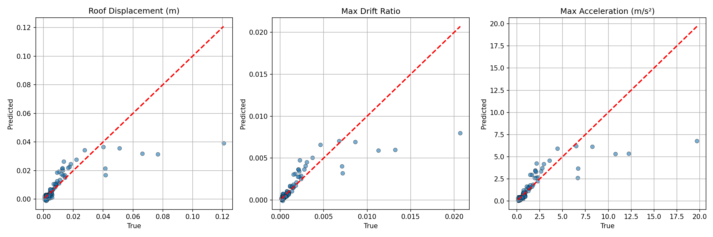
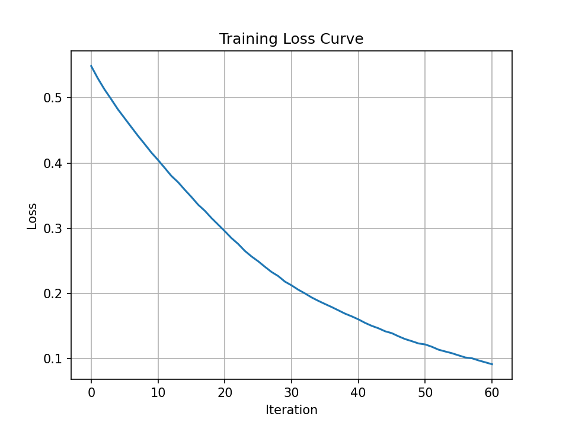

markdown
# FrameResponseNN: Neural Network Surrogate for Seismic Response Prediction

[](https://www.python.org/downloads/release/python-3100/)
[](https://opensees.berkeley.edu/)

**Author:** Parsa Rezaei  
**Affiliation:** Structural Engineer  
**Contact:** [Parsa.Rezaei.Z1@gmail.com](mailto:Parsa.Rezaei.Z1@gmail.com)

This repository presents a neural network surrogate model that predicts maximum seismic responses of a 2‑story steel moment frame. The training data is generated on‑the‑fly using OpenSeesPy with varying structural parameters and ground motion intensity. The project demonstrates a complete machine learning pipeline from physics‑based simulation to model evaluation.

---

## 🚀 Motivation

As a structural engineer transitioning into AI, I built this project to showcase my ability to:

- Integrate domain knowledge (structural engineering) with machine learning.
- Generate synthetic data from finite element simulations (OpenSeesPy).
- Build, train, and evaluate a neural network regressor (MLP).
- Structure a reproducible, well‑documented codebase.

This work is part of my application to AI master's programs in Korea and Germany.

---

## 🏗️ Methodology

### Structural Model
- **Frame:** 2‑story steel moment frame with elastic beam‑column elements.
- **Geometry:** 6 m bay width, 3 m story height.
- **Loading:** Uniform base excitation using a synthetic sine burst ground motion (Gaussian‑enveloped sine wave).
- **Damping:** Rayleigh damping (mass‑proportional) based on first mode frequency.

### Input Parameters (5)
- Elastic modulus `E` (190–210 GPa)
- Column moment of inertia `I_col` (1e‑4 to 5e‑4 m⁴)
- Floor mass `mass` (5000–15000 kg)
- Damping ratio `ζ` (0.02–0.05)
- Ground motion scale factor `scale` (0.5–2.0)

### Outputs (3)
- Maximum roof displacement (m)
- Maximum inter‑story drift ratio (dimensionless)
- Maximum floor acceleration (m/s²)

### Dataset
- **Size:** 500 samples generated via Latin Hypercube sampling.
- **Simulation time:** ~15 minutes on a standard laptop.

### Neural Network
- **Architecture:** Multi‑layer perceptron (MLP) with three hidden layers: 64, 64, 32 neurons.
- **Activation:** ReLU.
- **Optimizer:** Adam with adaptive learning rate.
- **Regularization:** L2 penalty (α = 0.001) and early stopping.
- **Train/Test split:** 80/20.
- **Feature scaling:** StandardScaler (fitted on training set, applied to test set).

---

## 📊 Results

After training on 500 samples, the model achieved the following performance on the test set:

| Output                 | MAE          | R²    |
|------------------------|--------------|-------|
| Roof Displacement (m)  | 0.0042       | 0.5793|
| Max Drift Ratio        | 0.0006       | 0.6416|
| Max Acceleration (m/s²)| 0.6294       | 0.6051|

*Note: The R² values around 0.6 indicate that the model captures some but not all of the variance. This is a reasonable starting point given the small dataset and linear‑elastic simulations. Performance can be improved with more samples, hyperparameter tuning, or a more complex architecture.*

### Visualizations

**Scatter plots:** Predicted vs. true values for each output. The red dashed line represents perfect prediction.



**Training loss curve:** Shows convergence of the MLP during training.



---

## 📁 Repository Structure
FrameResponseNN/
├── README.md
├── requirements.txt
├── .gitignore
├── data/ # Generated datasets (raw and processed)
├── models/ # Saved scalers and trained model
├── results/ # Plots and evaluation figures
└── src/
├── generate_data.py # OpenSeesPy simulation loop
├── preprocess.py # Data scaling & splitting
├── train.py # MLP training
├── evaluate.py # Performance visualization
└── main.py # Run the entire pipeline

text

---

## ⚙️ Setup and Usage

1. **Clone the repository**
   ```bash
   git clone https://github.com/Parsoo/FrameResponseNN.git
   cd FrameResponseNN